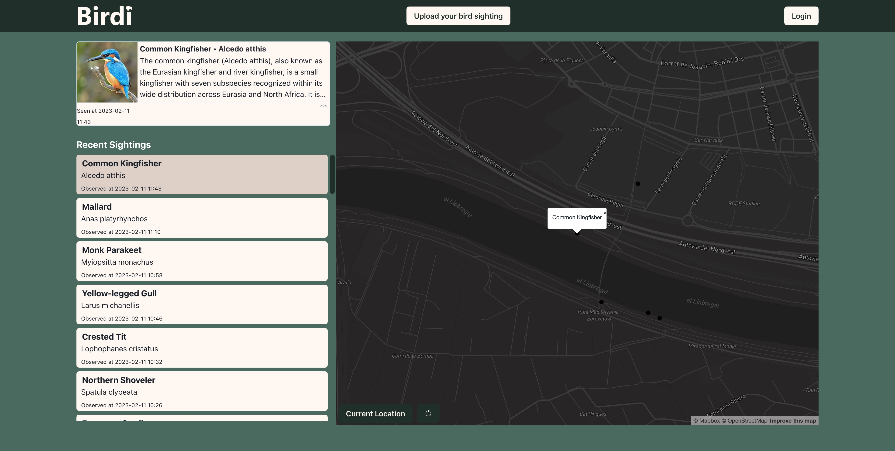
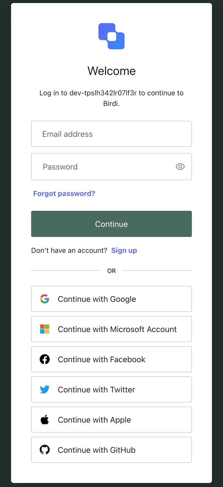
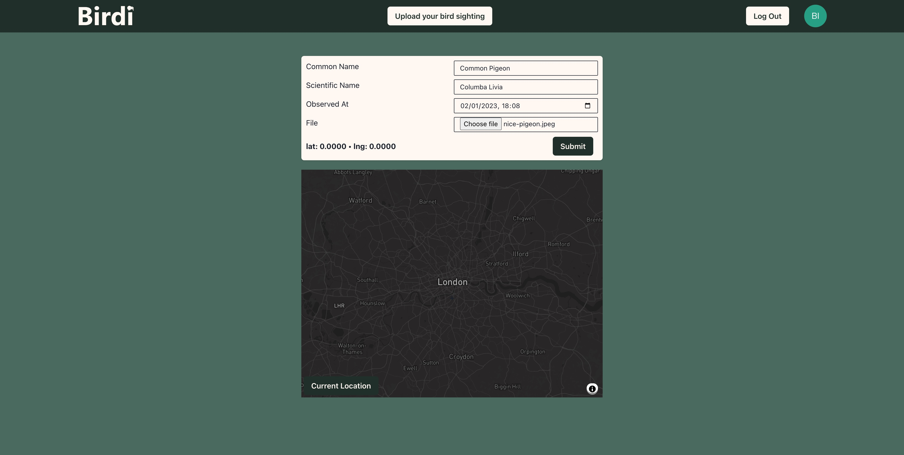
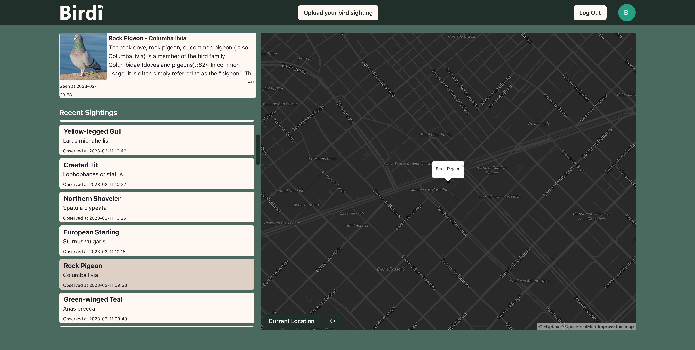

# Birdi - Developer Guide
Birdi is a bird sighting application that allows bird enthusiasts and ornithologists to record and track their bird sightings.
This guide provides detailed instructions for developers who want to set up and run Birdi locally.

Prerequisites
Before getting started, you should have the following tools installed on your system:

- Git
- Node.js and npm
- TypeScript
- nodemon

## Setting up the repository

1. Open your terminal and navigate to the directory where you want to store the Birdi repository.
2. Clone the repository using the following command:
  git clone [repository URL]
3. Navigate to the root directory of the cloned repository:
cd birdi

## Installing dependencies

1. In the root directory of the Birdi repository, run the following command to install the required dependencies:
  npm install
  
## Building the back-end

1. Navigate to the server directory of the Birdi repository:
  cd server
2. Compile the TypeScript code into JavaScript by running the following command:
  tsc build
  
## Running the server

1. Start the server using the following command:
  nodemon index.js

2. The server should now be running and listening for incoming requests.

## Building the front-end

1. Navigate to the client directory of the Birdi repository:
  cd ../client
2. Compile the TypeScript code into JavaScript by running the following command:
  tsc build
  
## Running the app

1. Start the front-end of the application by running the following command:
  npm run start
2. The front-end should now be running and accessible in your web browser at http://localhost:3000.

## Contributing
We welcome contributions to Birdi from the community. If you are interested in contributing, please read our
contribution guidelines and reach out to us at alexryanjones@gmx.com or contact.sethjplatt@gmail.com.

## Support
For support with setting up and running Birdi locally, please contact us at alexryanjones@gmx.com or contact.sethjplatt@gmail.com.

